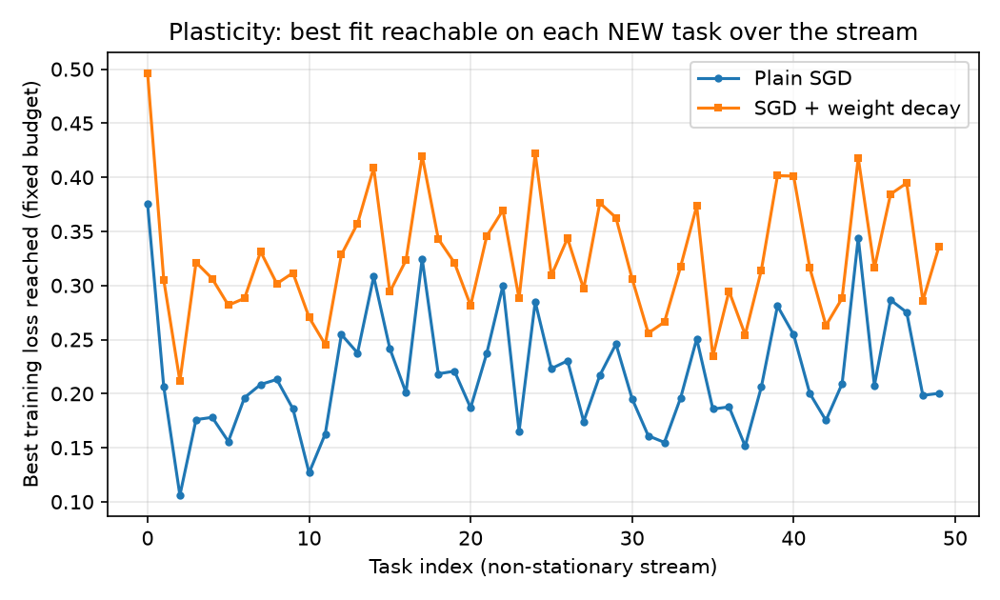
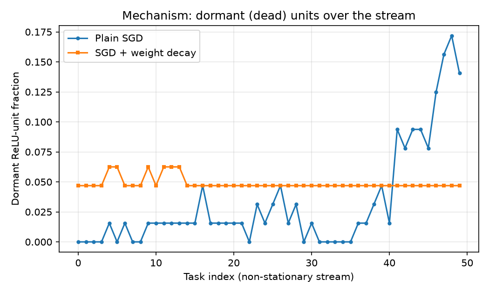

# Study

**Article:** Plasticity Loss in Deep Reinforcement Learning: A Survey

**Authors:** Klein, T., Miklautz, L., Sidak, K., Plant, C., and Tschiatschek, S.

**DOI/URL:** arXiv:2411.04832, https://doi.org/10.48550/arXiv.2411.04832

**Replication Type:** Proxy

**Computational Environment:** Python

**Primary Packages:** PyTorch 2.10, NumPy, Matplotlib

**Random Seed:** 735

**Repository:** https://github.com/Shail2512/anly735-lab02-Shail2512

# 1. Research Claim

The survey by Klein et al. (2024) synthesizes a body of evidence for a single
core claim: when a neural network is trained on a stream of non-stationary
tasks, it progressively loses the ability to learn new tasks, even though the
same network learned early tasks well [@klein2024plasticity]. This decline is
called plasticity loss. The survey ties it to a concrete mechanism, a growing
fraction of dormant or dead units whose activations collapse so that gradients
can no longer flow through them, and it reports that simple mitigations such as
weight regularization slow this decline. The primary evidence in the underlying
works is a learning curve that worsens across a task sequence, read together
with a unit-level dormancy diagnostic rather than from any single performance
drop. This result matters because it shows that a network can retain past skill
while quietly losing the capacity to acquire new skill, which is the exact
failure a continual learner must avoid.

# 2. Replication Strategy

This is a proxy replication. The survey is a review, so it provides no single
runnable experiment, dataset, or code, and its underlying studies use large
reinforcement-learning and image benchmarks that are not feasible to rerun in a
short laboratory. I therefore reproduce the phenomenon and its mechanism on a
comparable but smaller synthetic setup rather than reproducing any specific
number. I reproduce two things: first, that a plain stochastic-gradient learner
loses plasticity across a non-stationary task stream and accumulates dormant
units, and second, that a weight-decay mitigation preserves plasticity by
keeping units alive. What must differ from the original is the scale and the
domain: I use a small feed-forward network on a synthetic changing-target
stream instead of deep reinforcement learning. Because a proxy replication tests
whether the analytical pattern holds, the meaningful question is directional,
does the mechanism appear and does the mitigation help, not whether the numbers
match.

# 3. Data

The data are generated in code, so there is no external or restricted dataset to
distribute. The unit of analysis is a training task within a stream of 50
tasks. A fixed pool of 400 input vectors of dimension 20 is drawn once from a
standard normal distribution and reused for every task. Each task draws a fresh
random two-layer nonlinear teacher network with 128 hidden units and uses it to
relabel those same inputs into a balanced binary target by thresholding at the
median. Drawing a new teacher each task is what makes the stream
non-stationary: the mapping the learner must fit keeps changing, so the network
must overwrite its previous solution repeatedly. The teacher is deliberately
wider than the student network, so the target cannot be fit perfectly within the
per-task budget. This leaves headroom in which accumulated damage can show up as
a rising loss floor and a growing dormant-unit count. The same seed fixes the
input pool and the sequence of teachers, so both learners see an identical
stream.

# 4. Method

The learner is a two-hidden-layer ReLU network with 32 units per layer,
implemented in PyTorch. Two conditions are trained on the identical task stream
from the identical initialization (seed 735): a plain SGD learner with no
regularization, and a mitigation learner that is plain SGD with weight decay
(L2) of 0.03. Both use learning rate 0.4 and a tight budget of 40 gradient steps
per task, with binary cross-entropy loss. A high learning rate and a tight
budget are chosen deliberately, since the survey attributes plasticity loss to
aggressive updates that push ReLU pre-activations negative and leave units dead.
After the budget on each task I record three per-task quantities: the new-task
accuracy reached, the best training loss reached (a non-saturating plasticity
readout), and the dormant-unit fraction. A hidden unit is counted dormant if it
is inactive on at least 99 percent of a fixed 256-sample probe batch, which
operationalizes the survey's dead-unit mechanism. Plasticity is diagnosed from
how these quantities change across the stream, not from any one task, following
the assignment's instruction to diagnose from subsequent learning behavior.
Early behavior is summarized as the mean over the first five tasks and late
behavior as the mean over the last five.

# 5. Results

The plain SGD learner shows the predicted plasticity loss through its mechanism.
Its dormant-unit fraction rises from 0.3 percent over the first five tasks to
13.4 percent over the last five, a rise of about 13 percentage points, and the
figure shows this concentrated in the last third of the stream where it reaches
roughly 17 percent. Its best reachable loss also drifts upward, from 0.208 to
0.234, and its new-task accuracy dips slightly from 0.929 to 0.913. The
weight-decay learner behaves as the mitigation the survey describes: its
dormant-unit fraction stays essentially flat, moving from 5.0 percent to 4.7
percent across the stream, so it does not accumulate dead units. The key
interpretation is that the strongest and cleanest signal is the dormant-unit
mechanism, not raw accuracy. Accuracy barely moves because binary accuracy
saturates on this task, which is exactly why the survey and its sources read
plasticity from a mechanism-level diagnostic rather than from a single accuracy
number.

# 6. Compare

Because this is a proxy replication of a survey, the comparison is directional
rather than numerical. The survey claims two things, and I compare against both.

| Evidence | Original claim (survey) | Replication |
|---|---:|---:|
| Plasticity loss under non-stationarity | Dead units grow, learning degrades | Dormant units +13.1 pts, loss floor +0.026 |
| Regularization mitigates | Preserves plasticity | Dormant units flat (5.0% to 4.7%) |

The direction of the core finding is reproduced. The plain learner accumulates
dormant units across the stream and its loss floor drifts upward, which matches
the survey's mechanism-level account of plasticity loss. The mitigation claim is
also reproduced in the sense that matters: weight decay keeps the unit
population alive and stops the dormancy growth. One honest difference deserves
attention. Weight decay reaches a higher (worse) best loss than plain SGD
throughout the stream, so the mitigation does not produce lower loss; it
produces a healthier network. That is consistent with the survey, which frames
mitigations as preserving the capacity to learn rather than as improving fit on
any one task. The accuracy signal is weaker than the mechanism signal, which I
attribute to accuracy saturation on a binary target rather than to an absence of
the effect.

# 7. Reproducibility Check

- [x] Data source documented
- [x] Code runs from beginning to end
- [x] Computational environment identified
- [x] Software/packages documented
- [x] Package versions documented when relevant
- [x] Random seed documented when applicable
- [x] Key preprocessing steps documented
- [x] Evaluation procedure documented
- [x] Repository README provides reproduction instructions

**What was the greatest reproducibility challenge you encountered?**

The hardest part was making the phenomenon appear at all. My first two
configurations did not reproduce plasticity loss: with a single shared teacher
and a generous learning budget the network solved every task perfectly, so
accuracy rose across the stream and no units died. The effect only emerged once
the task was genuinely non-stationary (a fresh teacher per task), the teacher
was wider than the student, the budget was tight, and the learning rate was
high. This mirrors a real reproducibility lesson from the literature: plasticity
loss depends on the training regime, and a setup with too much capacity or too
easy a task will silently fail to show it.

# 8. Extend

The clearest next step is to add a mechanism-targeted mitigation and compare it
against weight decay under the same stream. Weight decay here preserved units
but at the cost of a higher loss floor, so a natural question is whether a
mitigation that directly targets dead units, such as periodically resetting or
reinitializing dormant units (the "resetting" family the survey highlights), can
preserve plasticity while also reaching a lower loss floor than plain SGD. This
would add knowledge rather than complexity because it separates two things the
current experiment conflates: preserving the unit population and preserving fit
quality. If a reset-based method matches plain SGD's loss floor while holding
dormant units low, that would be direct evidence that dead units are the causal
bottleneck rather than a correlate, which is exactly the mechanistic claim the
survey organizes its evidence around.

# Replication Verdict

- [ ] **Reproduced**
- [x] **Partially Reproduced**
- [ ] **Not Reproduced**
- [ ] **Not Directly Comparable**

The core mechanism of plasticity loss reproduced clearly: the plain SGD learner
accumulated dormant units across the non-stationary stream while the weight-decay
learner did not, matching both of the survey's central claims in direction. I
call it partially reproduced rather than reproduced because the accuracy readout
moved only weakly (binary accuracy saturates), so the effect is convincing at
the mechanism level but modest at the performance level, and because a proxy on
synthetic data cannot confirm the survey's specific reinforcement-learning
magnitudes.

# References

::: {#refs}
:::
